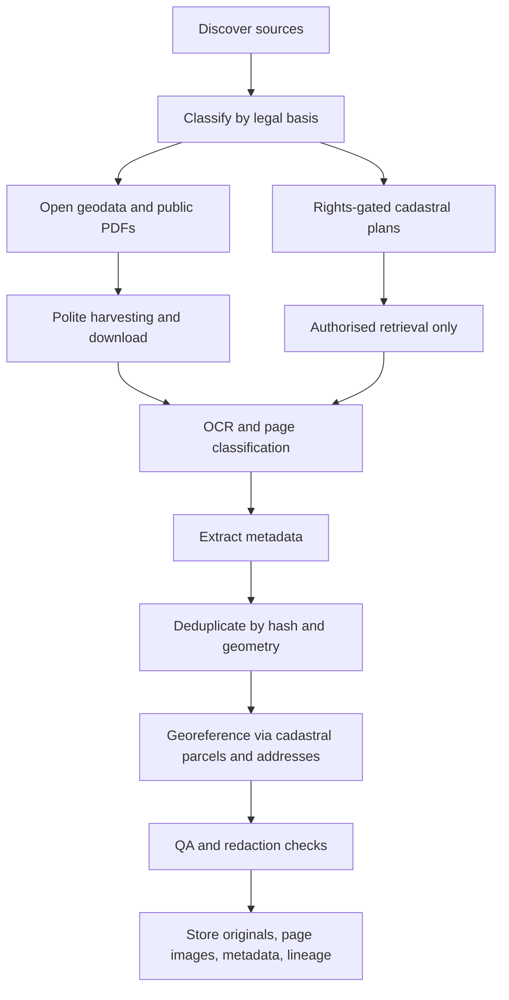

# Large-scale acquisition of Italian property floor plans

## Executive summary

A collection of **100,000+ Italian property floor plans is achievable only if “planimetrie” is interpreted broadly**—that is, as a mix of cadastral floor plans, urban-planning drawings, building-plan PDFs/DWGs, and plan pages extracted from judicial appraisals and public archives. If the target is instead **100,000 official cadastral planimetrie from the Catasto**, the combination of access restrictions and per-document pricing makes the objective **not realistically lawful within a €1–2k budget**. Official cadastral planimetries are reserved to right-holders or their delegates; Sister ordinarily does **not** expose planimetries in basic consultazione, and commercial brokers charge roughly **€12–€19+VAT per planimetry**, with some portals higher still. citeturn45search0turn45search2turn43view0turn18search1turn18search11turn18search14

The most economical route is therefore a **hybrid corpus strategy**. Use **free, high-yield public-document sources** first—above all the **Portale delle Vendite Pubbliche** and related auction portals, where many listings expose downloadable **perizia** and **planimetria** PDFs—then expand through **regional and municipal geoportals**, **RNDT** and **dati.gov.it** discovery, and selected **academic/municipal digital archives**. Official open cadastral cartography from Agenzia delle Entrate is extremely valuable for **georeferencing, deduplication, cadastral crosswalks, and metadata enrichment**, but it is **not** a source of unit-level Catasto floor plans; it exposes parcels and sheets through **WMS/WFS** and **bulk download** under **CC BY 4.0**. citeturn20search0turn20search2turn20search7turn38search2turn38search6turn10search0turn27search4turn11search7turn11search8

Within a **€1–2k cap**, the most defensible plan is to spend **almost nothing on raw acquisition infrastructure**, reserve at most **€500–€1,000** for a **small legally authorised benchmark set of official Catasto planimetrie** or for municipal archive fees where explicitly permitted, and obtain the remaining volume from free public-document channels. If you count **plan pages/images extracted from multi-page PDFs** rather than only one file per property, the 100k threshold becomes plausible. This is especially true for auction dossiers, which often contain separate plan attachments or several plan pages inside a single appraisal. citeturn18search1turn18search11turn20search0turn20search2turn38search2turn38search14

## Source landscape

### Official cadastral and fiscal sources

The Italian state’s **authoritative source for cadastral floor plans** is the **Agenzia delle Entrate**. Its public guidance defines the planimetria catastale as the technical drawing of a registered unit, typically at **1:200**, and states that it may be requested **free of charge by holders of real rights shown in the cadastre, or by their delegates**. For intermediaries, the delegation has **30-day validity**. The same official material also reiterates that, unlike ordinary visure, consultation of planimetries is reserved to the entitled parties. citeturn23search3turn45search0turn45search1turn45search14turn45search20

For institutional or programme-based access, **Sister** remains the core platform. However, its own manual is explicit that the ordinary consultazione service shows cadastral data, maps, elaborati planimetrici, and update acts, but **“ordinariamente” does not allow consultation of unit planimetries**. Public or private entities can subscribe to Sister under **Profile B**, with a **€15 annual fee per password**, and certain ordinary cadastral consultations then cost **€0.90** each; the system requires a prepaid deposit account and logs all consultations. The service runs continuously but the Agency reserves the right to limit access in case of malfunction or excessive traffic, and passwords cannot be used in multiple concurrent sessions. citeturn43view0

A distinct but crucial official source is the **Geoportale Cartografico Catastale** and its **WMS/WFS/bulk-download** services. These are openly available, do not require registration, and are released under **CC BY 4.0**. They are indispensable for linking plans to parcels, municipal sheets, and geospatial footprints, but they **do not expose private internal floor plans of units**. The WMS and WFS services impose an unspecified ceiling on **concurrent requests**. citeturn9search1turn9search2turn9search3turn10search0turn10search3turn11search1turn11search7turn35search0turn35search3

A special territorial case is the **Provincia autonoma di Trento**, which exposes an online owner-facing service for consulting unit planimetries in its territory; the page states that data are updated to the previous day and that the plan pages are in **A3** format for scale-faithful printing. This is still an owner-rights service, not an open bulk repository. citeturn23search13

### National catalogues and geospatial discovery layers

At national level, the most powerful discovery mechanisms are **dati.gov.it** and the **RNDT**. The former exposes a **CKAN API** and supports harvesting of metadata through standard CKAN mechanisms; the latter is the national territorial-data catalogue established under the CAD and supports **CSW discovery services** aligned with INSPIRE. These platforms are not themselves massive storages of floor plans, but they are the practical route to discovering municipal and regional datasets, WMS/WFS services, and downloadable archives containing plans, permit attachments, urban-planning tavole, and scanned drawings. citeturn7search0turn7search3turn7search1turn8search1turn8search4turn8search10

The **Geoportale Nazionale** is complementary. Its own documentation confirms the standard nature of **WMS** services and the fact that WMS yields image outputs rather than editable vector features. Again, this is less a floor-plan warehouse than a national access layer for territorial information and service discovery. citeturn7search5turn12search10

### Regional and municipal open-data/geoportal sources

Italy’s regional geoportals are heterogeneous but materially important. A few are particularly mature. **Lombardy** explicitly offers map consultation, metadata, **WMS**, **WFS**, and direct downloads; its legal notes show that datasets may be under **CC BY 4.0**, **CC BY-NC-ND 4.0**, or other constraints depending on the metadata. **Emilia-Romagna** exposes **WMS/WCS/WFS/WMTS**, downloadable geographic data, and for DBTR-like content even downloadable **Shapefile and DWG** outputs for selected areas; licensing is dataset-specific, often **CC BY 4.0** or **CC BY 3.0**, with restrictions signalled in metadata when applicable. **Tuscany** states that GEOscopio allows users to visualise, query, and **download** territorial data; its WMS page notes that services can be loaded in bulk into QGIS and that licence conditions vary by dataset. **Lazio** expressly says public cartographic layers are freely viewable, queryable, and downloadable by any user under **CC BY 4.0**, and it publishes WMS/WFS/WCS/CSW via GeoServer/GeoNode. **Sardinia** exposes WMS and WFS, has an “area sviluppatori”, and publishes many RAS-owned datasets under **CC BY 4.0**. citeturn12search0turn12search3turn39search0turn12search1turn12search7turn40search1turn40search11turn13search0turn13search11turn39search2turn15search1turn15search6turn40search2turn13search3turn13search7turn13search13turn39search6

Municipal geoportals often have the most relevant **urbanistic and building-plan PDFs**. **Rome’s GeoRoma** is especially rich: the city describes it as the single access point to city-produced geographic information, with layers for **cartografia comunale**, **PRG**, **SIS.CAT**, **SIT-PAU**, downloadable raster and vector data, and OGC interoperability through WMS/WFS plus APIs. **Turin’s Geoportale** explicitly allows download of city cartography in **PDF** and offers open-data catalogues and planning tables. These portals will not normally match Catasto in legal authority for unit floor plans, but they are among the best sources for mass urbanistic and building-plan material. citeturn16search2turn16search4turn16search3turn16search0turn31search11turn31search15

### Public-document repositories, auctions, municipal practice portals, archives, and private aggregators

For sheer scale under a small budget, the most important discovery is that **judicial-sale portals** often publish **perizia** and **planimetria** attachments openly. On the **Portale delle Vendite Pubbliche**, search snippets show many listings with downloadable planimetry PDFs attached to the announcement. The same is visible on private auction portals such as **Fallco Aste**, which frequently exposes separate **Perizia**, **Planimetria**, and photo documents. In practice these repositories are among the few Italian channels whose publicly downloadable document counts are large enough to support a 100k-scale plan corpus without per-document purchase costs. citeturn20search0turn20search2turn20search7turn20search14turn38search2turn38search6turn38search14

However, the legal perimeter is narrower than the public availability might suggest. Fallco explicitly states that publication is authorised by the competent authority and that **any replication or reproduction, even partial, is unauthorised**. That warning does not prevent ordinary access and download for the purposes allowed by the portal, but it is a strong signal that **mass republication or secondary redistribution of the raw corpus is high-risk**. citeturn38search2turn38search10turn38search14

Municipal **building-practice portals** are another useful class, but they vary radically. Platforms such as **InPratica** promise access to municipal building files and in some municipalities require **SPID/CIE/CNS**. These can be valuable where a municipality has chosen to expose documentation online, but they are not standardised nationally and may impose authentication, case-by-case access controls, or fees. citeturn38search3turn38search7turn38search15

Finally, there are **commercial intermediaries** and **real-estate listing portals**. Commercial brokers such as **VisureItalia**, **Pratiche.it**, **CatastoInRete**, and **EasyVisure** sell planimetries individually. Real-estate portals like **Immobiliare.it**, **Casa.it**, and **Idealista** often display a “Planimetria” tab on listings, and therefore can contain huge numbers of floor-plan images, but open reuse permissions are generally **not stated as open licences** on the public listing pages, and rights typically remain with the portal, agency, or seller. These are thus potential discovery sources, but poor choices for a redistribution-safe bulk corpus. citeturn18search1turn18search2turn18search6turn18search11turn24search8turn33search8turn34search1turn34search5turn34search8

## Exhaustive source catalogue

The table below is intentionally broad. Where a detail is not published in the cited source, it is marked **unspecified**.

| Source | Category | Access method | Typical formats | Licence / usage status | Cost model | Bulk / programmatic? | Main barriers |
|---|---|---|---|---|---|---|---|
| **Agenzia Entrate – planimetria online / sportello** citeturn45search0turn45search3 | Official cadastral floor plans | Authenticated web service; office request | PDF output; underlying archival representation unspecified | Restricted to right-holders or delegates; not open data citeturn45search0turn45search14 | Free for entitled parties citeturn45search0 | No lawful public bulk | SPID/CIE/CNS or delegation; one-property-at-a-time workflow |
| **Agenzia Entrate – Sister** citeturn43view0 | Official cadastral/registry platform | Authenticated web platform under convention | Tabular data, maps, elaborati planimetrici; planimetria access only in specific entitled workflows | Restricted contractual access | €15/year per password for Profile B; €0.90 per certain cadastral consultations; prepaid deposit required citeturn43view0 | Limited automation only through controlled account workflows; no public API | No public API; simultaneous sessions forbidden; excessive-traffic throttling |
| **Geoportale Cartografico Catastale WMS** citeturn26search0turn29search0 | Official open cadastral cartography | WMS 1.3.0 | PNG/JPEG map images | **CC BY 4.0** citeturn11search10turn11search8 | Free | Yes, but not floor-plan bulk | Concurrent-request limit unspecified citeturn35search0 |
| **Geoportale Cartografico Catastale WFS** citeturn27search4 | Official open cadastral cartography | WFS 2.0.0 | GML/XML; vector features | **CC BY 4.0** citeturn11search7 | Free | Yes; point queries and service consumption | Concurrent-request limit unspecified citeturn35search3 |
| **Download massivo cartografia catastale** citeturn10search0turn28search1 | Official open cadastral bulk download | Bulk web download | Vector cadastral parcel data in GML/XML ZIP-like packaging | **CC BY 4.0** via cartography service family citeturn11search1turn11search7 | Free | Yes, fully bulk for parcels/sheets | Not a source of internal unit plans |
| **RNDT** citeturn7search1turn8search10 | National territorial metadata catalogue | Web search; **CSW** discovery | Metadata XML/CSW records | Metadata service; per-linked dataset licence varies | Free | Yes; programmatic discovery via CSW citeturn8search0turn8search4 | Discovery only; actual data hosted elsewhere |
| **dati.gov.it** citeturn7search0turn7search3 | National open-data catalogue | Web portal; **CKAN API** | JSON metadata; linked resources vary | Per-dataset licence in metadata; not uniform | Free | Yes; programmatic discovery/harvesting | Discovery only unless resource URLs are open |
| **Geoportale Nazionale** citeturn7search5turn12search10 | National geospatial access layer | Web viewer; WMS-oriented services | Map images | Dataset/service-specific | Free | Mostly programmatic via linked services | Not a direct floor-plan repository |
| **Provincia autonoma di Trento – owner plan service** citeturn23search13 | Official provincial cadastral plan access | Authenticated web service | A3 plan pages, likely PDF | Restricted to owners / entitled users | Free for entitled users | No public bulk | Rights-gated; territorial scope limited to Trento |
| **Regione Lombardia Geoportale** citeturn12search0turn12search3turn39search0 | Regional open geoportal | Viewer, WMS/WFS, download | Raster, vector; dataset-specific | Mixed, often CC BY 4.0 or other metadata-stated terms | Free | Often yes | Licence and formats vary by dataset |
| **Regione Emilia-Romagna Geoportale** citeturn12search1turn12search7turn40search11 | Regional open geoportal | Download, WMS/WFS/WCS/WMTS | Shapefile, DWG, WMS/WFS, other dataset-specific outputs | Often CC BY 4.0 / CC BY 3.0, but dataset-specific | Free | Yes | Some datasets restricted or differently licensed |
| **Regione Toscana GEOscopio** citeturn13search0turn13search11turn39search2 | Regional geoportal | WebGIS, WMS, downloadable open geodata | WMS, ZIP/QGIS packages, dataset-specific formats | Dataset-specific; not uniform across all layers | Free | Often yes | Licence varies by layer; some third-party data under narrower terms |
| **Regione Lazio Geoportale** citeturn15search1turn15search6turn40search2 | Regional geoportal | GeoServer/GeoNode WMS/WFS/WCS/CSW | Vector and raster web-service outputs | **CC BY 4.0** for public cartographic layers | Free | Yes | Excellent for planning/territorial layers, not unit floor plans |
| **Sardegna Geoportale** citeturn13search3turn13search7turn39search6 | Regional geoportal | WMS/WFS, developer area, downloads | Raster, vector, dataset-specific archives | **CC BY 4.0** for RAS-owned data | Free | Yes | Dataset scope broader than floor plans |
| **GeoRoma** citeturn16search2turn16search4 | Municipal geoportal | Web portal, WMS/WFS, APIs, local downloads | PDF, raster, vector | Municipal/public-dataset terms; not uniformly specified in snippet | Free for published layers | Partial bulk/programmatic | Mixed layers; some extracts require validation or user context |
| **Geoportale Torino** citeturn16search0turn16search3turn31search11 | Municipal geoportal | Web portal; downloadable cartography | PDF and portal-linked layer outputs | Municipal/open-data terms vary | Free | Some bulk; some direct download | Best for urban-planning forms/tavole rather than unit plans |
| **PVP Giustizia** citeturn21search0turn20search0turn20search2 | Official judicial-sale repository | Web search and document download | PDF and image attachments | Publicly downloadable procedure documents; reuse terms not stated as open licence | Free | No public API documented | HTML crawling needed; no explicit bulk export cited |
| **Fallco Aste** citeturn38search2turn38search10turn38search14 | Judicial-sale portal | Web listings + downloadable docs | PDF, images | Explicit warning against replication/reproduction | Free to access listings | No public API cited | Contractual/reuse risk; per-listing crawl |
| **InPratica / municipal practice portals** citeturn38search3turn38search7turn38search15 | Municipal building-practice access | Web portal, often identity-gated | PDFs and attached practice documents; exact set depends on municipality | Municipality-specific; generally not open by default | Often free to search; fees unspecified | Programmatic access unspecified | SPID/CIE/CNS; municipality-by-municipality variation |
| **Internet Culturale / Archivio Digitale / State archives** citeturn23search9turn22search3turn23search7 | Academic / municipal / state archives | Web catalogues and digital collections | Images, PDFs, archival scans; precise formats collection-specific | Rights vary by collection; often not open for unrestricted commercial republication unless stated | Usually free to consult | Programmatic harvesting generally unspecified | Heterogeneous metadata and rights |
| **OpenStreetMap indoor data** citeturn32search1turn32search2turn32search15 | Crowdsourced | Overpass API, planet extracts | OSM XML, JSON, GeoJSON via tooling | ODbL ecosystem; not a cadastral/official floor-plan source | Free | Yes | Sparse indoor coverage; national-scale Overpass extraction discouraged |
| **Commercial brokers: VisureItalia / Pratiche.it / CatastoInRete / EasyVisure** citeturn18search1turn18search2turn18search6turn18search11turn24search8 | Commercial | Web order forms; some internal automation | PDF | Contractual service terms; not open data | Roughly €12–€19+VAT, sometimes ~€14.90+VAT or ~€29.80 list price | No public bulk API cited | Rights/delegation still required; cost explodes at scale |
| **Real-estate portals: Immobiliare.it / Casa.it / Idealista** citeturn33search8turn34search1turn34search5turn34search8 | Commercial / listing discovery | Web pages | Images, listing PDFs, plan tabs | No open licence stated on public listing pages; copyright likely retained by portal/agents | Free to browse | No public API cited | ToS/copyright risk; uneven plan coverage |

## Top source comparison

The most strategically relevant ten sources are compared below.

| Source | Access | Cost realism | Format value | Bulk capability | Suitability for 100k target |
|---|---|---:|---|---|---|
| **PVP Giustizia** citeturn21search0turn20search0turn20search2 | Public web | €0 | PDF dossiers, often with plan pages | Moderate via respectful crawling; no public API cited | **High** |
| **Fallco Aste** citeturn38search2turn38search6 | Public web | €0 | Separate planimetria/perizia PDFs | Moderate; per-listing crawling | **High**, but reuse risk |
| **Agenzia Entrate planimetria online** citeturn45search0turn45search3 | Rights-gated | €0 for entitled users | Authoritative cadastral PDFs | No public bulk | **Low at 100k without rights portfolio** |
| **Sister** citeturn43view0 | Contracted web platform | €15/password/year + usage tributes | Authoritative cadastral/registry data | Limited; no public API | **Low–medium**, mainly for authorised benchmarking |
| **Catasto open WFS / bulk cartography** citeturn27search4turn28search1 | Public WFS/bulk | €0 | Parcel/sheet vectors, GML/XML | **High** | **High** as metadata/georef backbone, **not** as floor-plan source |
| **RNDT** citeturn7search1turn8search10 | Public CSW/catalogue | €0 | Metadata and service discovery | **High** | **High** as discovery layer |
| **dati.gov.it** citeturn7search0turn7search3 | Public CKAN catalogue | €0 | Metadata + linked resources | **High** | **High** as discovery layer |
| **Regione Emilia-Romagna Geoportale** citeturn12search1turn12search7turn40search11 | Public web services/downloads | €0 | Shapefile, DWG, WFS/WMS | **High** | **Medium–high** |
| **Regione Lazio Geoportale** citeturn15search1turn15search6turn40search2 | Public GeoServer/GeoNode | €0 | WMS/WFS/WCS/CSW | **High** | **Medium–high** |
| **GeoRoma / Torino municipal geoportals** citeturn16search2turn16search0turn16search3 | Public municipal portals | €0 | PDF tavole, vector/raster layers | Medium | **Medium** |

## Legal and ethical constraints

The decisive legal fact is simple: **official Catasto planimetrie are not open data**. Agenzia delle Entrate states that planimetries may be requested only by **holders of real rights appearing in the cadastre or by their delegates**, and its own explanatory materials contrast this with the broader accessibility of standard visure. The older circular principle remains consistent: copies of urban-unit planimetries may be released only at the request of the owner or other entitled persons. citeturn45search0turn45search3turn45search14turn45search20turn45search2

Municipal building files and urbanistic practice documents are not automatically free for mass republication merely because some are obtainable. The Garante has repeatedly treated **plans, maps, projects, CILA attachments, interior photographs, and related technical documentation** as material capable of revealing private information and commercially sensitive information. Several opinions support partial denial, redaction, or limited disclosure where a request would prejudice privacy or economic/commercial interests. This matters especially if you were considering indiscriminate scraping of **SUE/SUAP** portals or public practice ledgers. citeturn25search1turn25search3turn25search7turn25search11turn25search13turn25search16

By contrast, the **open cadastral cartography** services of Agenzia delle Entrate are explicitly distributed under **CC BY 4.0**, and several regional geoportals likewise publish data under **CC BY 4.0** or other explicit Creative Commons licences. Those datasets can normally be reused, transformed, and merged—subject to attribution and, where applicable, non-commercial or share-alike clauses stated in metadata. The legal trap is therefore not “Italian geodata” in general; it is the mistaken assumption that **unit-level Catasto planimetrie** belong to the same open-data universe as parcel map layers. They do not. citeturn11search1turn11search7turn11search10turn39search0turn40search11turn40search2turn39search6

Auction portals are the greyest zone. They often make documents publicly downloadable, and many documents are published with privacy omissis. Yet at least some portals, such as Fallco, expressly prohibit replication and reproduction. Accordingly, the safest stance is this: **harvest for internal analytical use, maintain provenance, do not republish the raw original documents at scale, and extract only the minimum needed derivative metadata or redacted plan pages if you have a defensible legal basis**. citeturn38search2turn38search10turn38search14

## Acquisition strategy within a €1–2k budget

### What is actually feasible

A lawful, economically rational plan should target **three outputs at once**: an internal **plan image corpus**, a **metadata index**, and a **geospatial backbone**. In that model, the bulk of the 100k target comes from **public-document plan pages** extracted from auctions and open archives, while the geospatial backbone comes from **open cadastral cartography** and regional WFS/WMS services. A **small paid benchmark subset** of official Catasto planimetrie is then acquired only where you have lawful entitlement or explicit delegation, to calibrate OCR, page classifiers, symbol dictionaries, and deduplication rules. citeturn20search0turn20search2turn38search2turn10search0turn27search4turn11search7turn18search1

### Recommended priority order

First, harvest **PVP Giustizia**, **Fallco**, and other public auction portals for listings whose documents visibly include **planimetria**, **estratto mappa**, **elaborato planimetrico**, or appraisal PDFs likely to embed plans. This is the highest-yield, lowest-cash source. Second, use **RNDT** and **dati.gov.it** to enumerate municipal and regional datasets matching queries such as *planimetria*, *elaborato planimetrico*, *tavola*, *progetto*, *permesso di costruire*, *CILA*, *SCIA*, *PDF*, *DWG*, and *DXF*, then expand to the actual host portals. Third, layer in the strongest regional and municipal sources—especially **Lazio**, **Emilia-Romagna**, **Tuscany**, **Sardinia**, **Rome**, and **Turin**—to acquire open urbanistic/building drawings and contextual cartography. Fourth, buy a **small, clean, authorised Catasto gold set** only if you truly need authoritative unit-floor-plan exemplars. citeturn20search0turn20search2turn38search2turn7search0turn7search1turn12search1turn15search1turn13search0turn13search13turn16search2turn16search0turn18search1

### Suggested budget

| Item | Low estimate | High estimate | Notes |
|---|---:|---:|---|
| Storage, local disks / object storage / backups | €150 | €400 | For roughly 100–300 GB working set plus derivatives; estimate depends on whether you store originals, thumbnails, OCR, and extracted page PNGs. This is an engineering estimate. |
| Proxying / bandwidth / retries / cloud VM time | €100 | €300 | Only if you do not run locally; keep modest and compliant. Engineering estimate. |
| Small authorised Catasto benchmark set | €300 | €900 | Example: 20–60 planimetrie purchased through lawful delegation or broker pricing around €12–€19+VAT each. citeturn18search1turn18search11turn18search14 |
| Municipal archive fees / certified copies / ad hoc requests | €0 | €300 | Highly variable; often unspecified by portal. |
| Contingency | €200 | €300 | Failures, rescans, manual QA. |
| **Total** | **€750** | **€2,200** | Keep the Catasto benchmark small to stay within cap. |

A disciplined plan can therefore stay near **€900–€1,400** if you avoid using paid Catasto services for scale and reserve them for validation only. Conversely, attempting scale purchase from brokers would destroy the budget almost immediately: even at **€12 + VAT**, 100,000 Catasto planimetrie would be in the **seven figures**, not the low thousands. citeturn18search1turn18search11turn18search14

### Expected throughput, time, and bandwidth

A realistic campaign is **days to a few weeks**, not hours. Public auction and archive PDFs vary from a few hundred kilobytes to several megabytes; cited examples include plan attachments around **1.04 MB**, **2.37 MB**, **2.73 MB**, and more. On that basis, a 100k-scale corpus of **plan pages or plan-bearing PDFs** can easily land in the **50–250 GB** band before OCR and thumbnails. That estimate is an inference from observed sample attachment sizes and typical document structure, not an official quota. citeturn20search0turn20search2turn20search14turn38search6

### Acquisition workflow



### Storage and metadata model

I would store **original files unchanged**, then derived **page images** and **structured metadata** in a separate layer. A practical schema could include:

| Field | Purpose |
|---|---|
| `source_family` | `catasto`, `auction`, `municipal`, `regional`, `archive`, `crowd`, `commercial` |
| `source_name` | Exact portal or institution |
| `source_url` | Canonical document or listing URL |
| `acquisition_basis` | `open_ccby`, `public_document_internal_use`, `delegated_catasto`, `unclear_unspecified` |
| `document_type` | `planimetria_catastale`, `elaborato_planimetrico`, `perizia`, `tavola_urbanistica`, `dwg_progetto`, etc. |
| `file_sha256` / `page_sha256` | Deduplication |
| `mime_type` / `extension` | File handling |
| `licence_text` / `licence_code` | Rights tracking |
| `comune`, `provincia`, `regione` | Territorial indexing |
| `foglio`, `particella`, `subalterno` | When recoverable |
| `address_normalised` | Joining and dedup |
| `bbox`, `crs`, `parcel_id` | Georeferencing context |
| `plan_page_numbers` | Plan-page extraction |
| `ocr_text` | Searchability |
| `redaction_status` | Privacy control |
| `confidence_scores` | QA, symbol confidence, OCR confidence |

## Technical tooling, scripts, and query examples

For discovery and download, the key tools are **QGIS**, **GDAL/OGR**, **Python** (`requests`, `httpx`, `beautifulsoup4`, `lxml`, `pypdf`, `pdfplumber`, `pytesseract` if needed, `geopandas`, `shapely`), and for OSM discovery **Overpass** tooling. QGIS is particularly helpful because several Italian portals explicitly publish WMS/WFS services or even QGIS-ready bundles. For national-scale OSM indoor extraction, the Overpass wiki warns that dynamic national queries are inefficient; full mirrors or static extracts are preferable. citeturn13search11turn32search1turn32search15

The most useful official endpoints are the following:

- **dati.gov.it CKAN API** for metadata discovery: the portal documents API access to the catalogue. citeturn7search0  
- **RNDT CSW** discovery service: the official CSW GetCapabilities URL is published by RNDT. citeturn8search0turn8search10  
- **Agenzia Entrate cadastral cartography WMS**: the official WMS GetCapabilities URL is published on both Agenzia and Developers Italia. citeturn26search0turn26search3  
- **Agenzia Entrate cadastral cartography WFS**: the official WFS endpoint is published on Agenzia’s service page. citeturn27search4  
- **Regione Lazio GeoServer WMS/WFS**: the Geoportale publishes GeoServer OWS endpoints and developer documentation for WMS/WFS/WCS/CSW. citeturn15search4turn15search6turn15search12

A few concrete examples:

```bash
# dati.gov.it catalogue search
curl 'https://www.dati.gov.it/api/3/action/package_search?q=planimetria'

# RNDT CSW capabilities
curl 'https://geodati.gov.it/RNDT/csw?request=GetCapabilities&service=CSW&acceptFormats=application/xml&LANGUAGE=ita'

# Agenzia Entrate cadastral WMS capabilities
curl 'https://wms.cartografia.agenziaentrate.gov.it/inspire/wms/ows01.php?SERVICE=WMS&VERSION=1.3.0&REQUEST=GetCapabilities'

# Agenzia Entrate cadastral WFS capabilities
curl 'https://wfs.cartografia.agenziaentrate.gov.it/inspire/wfs/owfs01.php?SERVICE=WFS&VERSION=2.0.0&REQUEST=GetCapabilities'

# Example Lazio GeoServer WFS capabilities
curl 'https://geoportale.regione.lazio.it/geoserver/ows?request=GetCapabilities&service=WFS&version=1.1.0'
```

Those endpoint patterns are taken directly from the cited official pages and service descriptions. citeturn8search0turn26search0turn26search3turn27search4turn15search4turn15search12

A minimal Python pattern for **respectful PDF acquisition from public listing pages** might look like this:

```python
from __future__ import annotations

import hashlib
import time
from pathlib import Path
from urllib.parse import urljoin

import requests
from bs4 import BeautifulSoup

SESSION = requests.Session()
SESSION.headers.update({
    "User-Agent": "research-bot/1.0 (+contact-email)"
})

def sha256_bytes(data: bytes) -> str:
    return hashlib.sha256(data).hexdigest()

def fetch_listing(url: str) -> str:
    r = SESSION.get(url, timeout=30)
    r.raise_for_status()
    return r.text

def extract_pdf_links(html: str, base_url: str) -> list[str]:
    soup = BeautifulSoup(html, "html.parser")
    links = []
    for a in soup.select('a[href$=".pdf"], a[href*=".pdf"]'):
        href = a.get("href")
        if href:
            links.append(urljoin(base_url, href))
    return sorted(set(links))

def download_pdf(url: str, out_dir: Path) -> Path:
    r = SESSION.get(url, timeout=60)
    r.raise_for_status()
    content = r.content
    digest = sha256_bytes(content)
    path = out_dir / f"{digest}.pdf"
    path.write_bytes(content)
    return path

def main() -> None:
    out_dir = Path("downloads")
    out_dir.mkdir(exist_ok=True)
    listing_url = "https://example.invalid/listing"
    html = fetch_listing(listing_url)
    for pdf_url in extract_pdf_links(html, listing_url):
        try:
            path = download_pdf(pdf_url, out_dir)
            print(f"saved {path}")
            time.sleep(2.0)   # keep concurrency low
        except requests.HTTPError as exc:
            print(f"skip {pdf_url}: {exc}")

if __name__ == "__main__":
    main()
```

For geospatial downloads, **GDAL/OGR** is usually faster than writing custom parsers:

```bash
# Example: inspect WFS layers
ogrinfo WFS:'https://wfs.cartografia.agenziaentrate.gov.it/inspire/wfs/owfs01.php' -so

# Example: export a municipal/regional WFS layer to GeoPackage
ogr2ogr -f GPKG out.gpkg \
  WFS:'https://geoportale.regione.lazio.it/geoserver/ows?service=WFS&version=1.1.0&request=GetCapabilities'
```

And for OSM indoor experiments:

```bash
curl -G 'https://overpass-api.de/api/interpreter' \
  --data-urlencode 'data=[out:json][timeout:120];
    area["ISO3166-1"="IT"][admin_level=2]->.it;
    (
      way["indoor"](area.it);
      relation["indoor"](area.it);
      node["indoor"](area.it);
    );
    out body;'
```

That last route is useful only for **crowdsourced indoor mapping**, not for official or comprehensive Italian floor plans, and the OSM community documentation itself cautions against relying on Overpass for full national extraction when static mirrors would be more appropriate. citeturn32search1turn32search2turn32search15

## Risks and mitigation

The first risk is **category confusion**. Italian sources use overlapping terms—*planimetria catastale*, *elaborato planimetrico*, *tavola urbanistica*, *progetto*, *perizia*, *estratto mappa*—for legally and technically distinct objects. If you do not model those distinctions, your corpus will be noisy and hard to use. The remedy is to maintain a strict document taxonomy and to treat official Catasto planimetrie as a separate gold-standard class. citeturn23search3turn43view0turn38search2

The second risk is **duplication and stale variants**. The same property may appear in multiple listings, in separate plan PDFs, embedded within appraisals, or in later sales of the same procedure. Use file hashes, page hashes, textual similarity on OCR, and cadastral identifiers where available. Judicial-sale sources often provide those identifiers directly in the listing text. citeturn38search10turn20search14

The third risk is **georeferencing drift**. Many floor plans are not georeferenced; some are scans of older paper documents. Open cadastral parcel services are the obvious mitigation: join plans to parcels through **foglio/particella/subalterno**, municipal address search, and parcel geometry retrieved from GCC WFS/bulk datasets. citeturn27search4turn10search0turn11search7

The fourth risk is **licence contamination**. A technically harvestable source is not always a legally reusable one. Keep a provenance column for every document and segregate at least three buckets: **openly reusable**, **internally usable with caution**, and **authorisation required**. Regional WFS/WMS datasets often publish clear licences; auction portals and listing portals often do not. citeturn39search0turn40search11turn40search2turn38search2

The fifth risk is **privacy leakage**. Municipal practice files and even some appraisal dossiers may contain names, ID copies, interior photos, phone numbers, or other incidental personal data. Design the pipeline to support **redaction status**, **page-level exclusion**, and **separate storage for raw vs. derived corpora**. The Garante’s opinions make it clear that these materials can engage both privacy and economic-interest concerns. citeturn25search1turn25search3turn25search7turn25search13

The final strategic risk is **misaligned expectations about cost**. If the requirement is truly “100,000 official cadastral floor plans, individually lawful, individually attributable, and redistributable”, the present budget is mis-specified by orders of magnitude. If, instead, the requirement is “100,000+ Italian property-plan artefacts for internal analysis, indexing, or model training, spanning cadastral, building, and urbanistic families”, then the budget is credible—provided the acquisition philosophy remains **free-source first, gold-set only for paid official exemplars**. citeturn45search0turn43view0turn18search1turn18search11turn20search0turn38search2